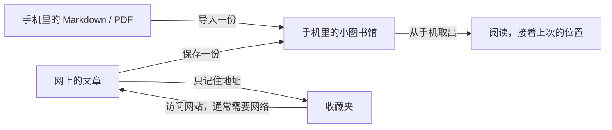
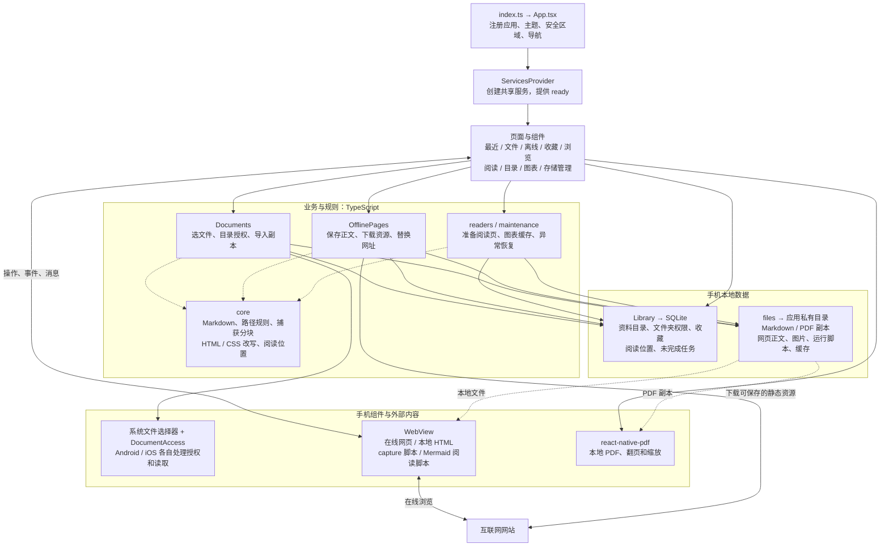
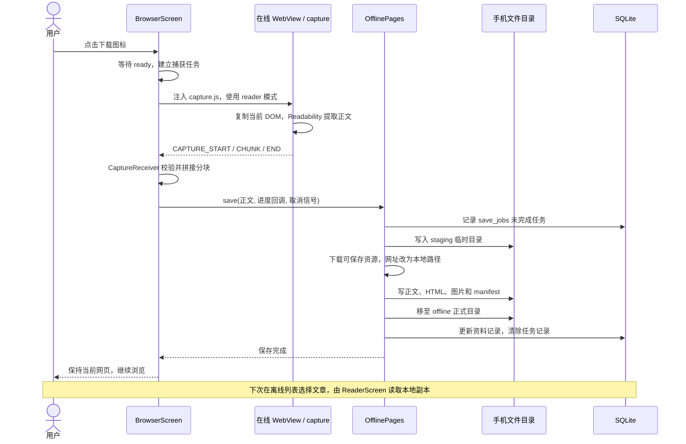
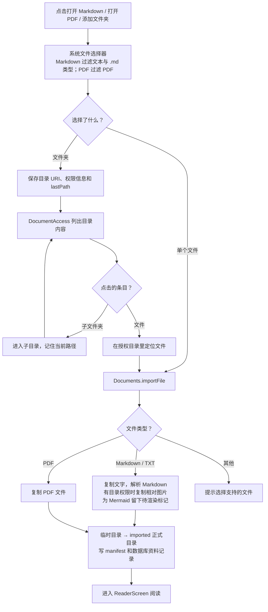
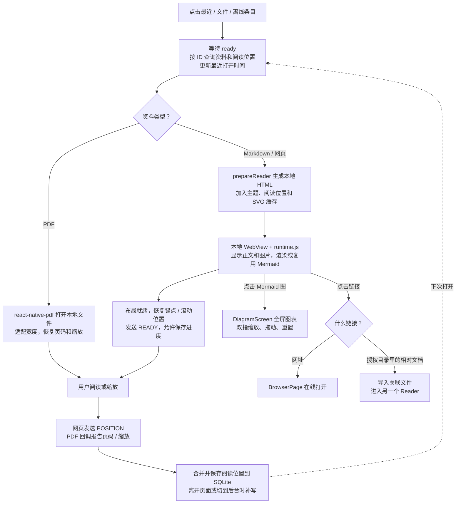
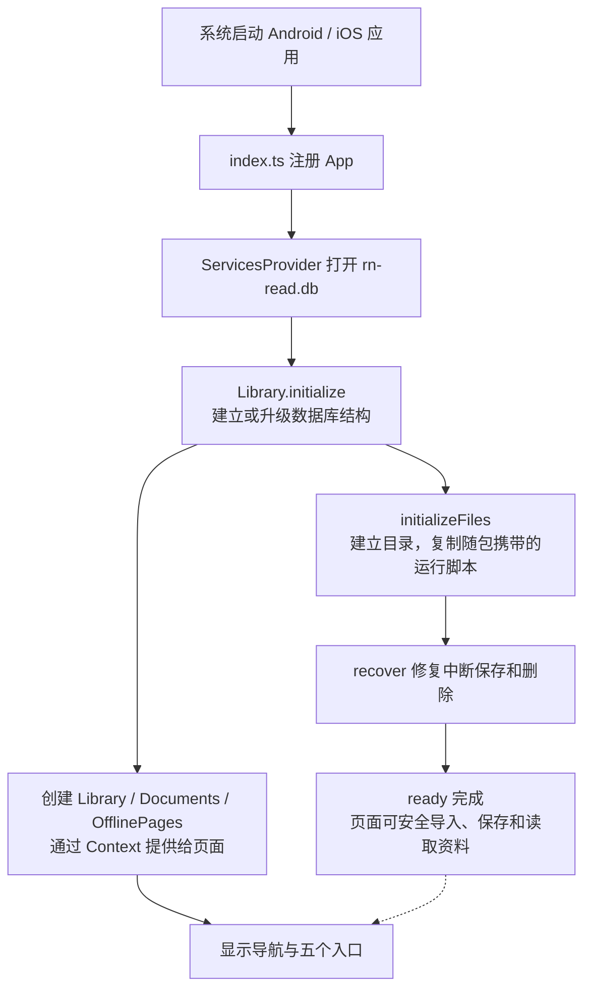
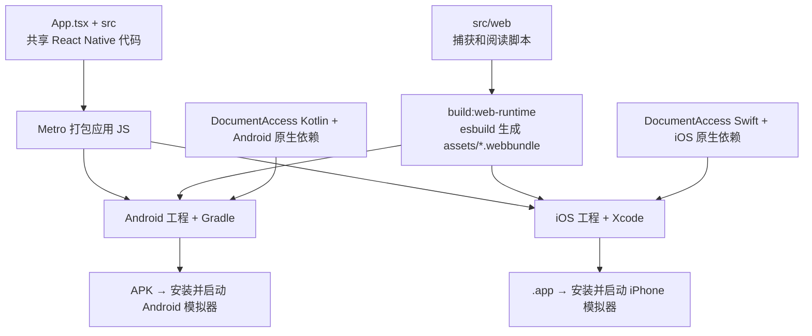

# RN Read：项目架构、流程和入门解释

这份文档按 **2026-10-07 的实际源码**绘制，描述当前已实现的应用。Android 和 iOS 共用主要业务代码；底部有最近阅读、文件、离线、收藏、浏览五个入口。

想直接看画好的图，可以用浏览器打开 [架构与流程图.html](架构与流程图.html)。本文里的 Mermaid 图也可以通过本项目的 Markdown 阅读器查看；单张矢量图在 [diagrams](diagrams) 目录。

## 1. 先把手机想成一座可以随身带走的小图书馆

你在网上看到一篇故事，想明天在没有网络的地方继续读。

这个 App 会把故事和能保存的图片装进手机。明天读的时候，从手机里取出来，就不用再等网站把故事送过来。

它还可以打开你手机里的 Markdown 和 PDF。读到一半关掉，下次它会记得你读到哪里。

<!-- diagram: pocket-library -->


**收藏**像在小纸条上写下书店地址；**离线保存**像把一本书放进书包。只有地址，还得去书店；书已经在书包里，就可以直接拿出来读。

这里的“快”主要来自不用重新请求网站。打开大 PDF 或画复杂图表仍然需要手机做一些工作，因此不是所有内容都能瞬间显示。

## 2. React Native 到底是什么？

把做 App 想成搭积木：你写一份搭建说明，React Native 帮你在 Android 和 iPhone 上搭出界面。

- `View` 是一个盒子，用来装其他积木。
- `Text` 是写着字的积木。
- `Pressable` 是可以按的积木。
- **组件（Component）**是一组装好的积木，例如工具栏、文件列表或整个阅读页面。
- **React**负责根据当前数据描述“界面应该长什么样”；**React Native**让这些描述在手机上显示和响应操作。
- **TypeScript**是本项目写搭建说明的语言。它能在开发时帮助发现“这里应该是网址，却传来一个数字”之类的错误。
- **Expo**提供启动、打包和访问手机功能的工具。本项目需要编译原生应用，不能直接用 Expo Go 运行全部功能。

可以把 `state` 理解为一张会改变的小纸条。收藏按钮旁边的纸条写着“没收藏”，就画收藏图标；点一下，纸条改成“已收藏”，React 会据此更新界面。

下面是帮助理解的简化例子，不是项目的完整收藏代码：

```tsx
const [bookmarked, setBookmarked] = useState(false);

// 纸条变了，界面也跟着变。
<Pressable onPress={() => setBookmarked(!bookmarked)}>
  <Text>{bookmarked ? "已收藏" : "收藏"}</Text>
</Pressable>;
```

这张小纸条只存在于运行中的程序里。要关掉 App 后还记得收藏，实际项目还会把网址写进手机数据库，再从数据库读回来。

`props` 是交给组件的小纸条：比如同一个 `LibraryScreen`，收到 `mode="recent"` 就显示最近阅读，收到 `mode="offline"` 就显示离线网页。`useEffect` 可以理解为“页面出现或条件改变时，要顺便做的事情”，例如读取文件列表；`Context` 是所有页面共用的工具柜，本项目用它提供数据库和文件服务。

两种手机的大部分搭建说明相同，但开文件权限这类事情要遵守各自系统的规定，所以有少量 Android 和 iOS 专用代码。

## 3. 实际架构：每个人负责哪件事？

图中实线表示主要调用或数据流；虚线表示辅助关系。WebView 是 App 里面的一扇小浏览器窗口，它既能打开网站，也能打开手机里的 HTML。

<!-- diagram: architecture -->


这是一款主要在手机本地工作的应用，目前没有自建后端或云同步服务。在线浏览和保存资源时访问网站；已经保存的副本从手机读取。

| 项目里的部分 | 小图书馆里的角色 | 实际职责 |
| --- | --- | --- |
| `App.tsx`、导航 | 大门和路牌 | 决定页面入口、切换页面、返回 App 上一页 |
| `src/screens` | 各个柜台 | 接收点击、显示列表和内容、调用服务 |
| `src/components` | 共用的积木 | 按钮、条目、错误提示、加载状态 |
| `src/app/context.tsx` | 共用工具柜 | 初始化并提供 `library`、`documents`、`offline` |
| `src/services` | 图书管理员 | 执行导入、保存、阅读准备和清理任务 |
| `src/core` | 整理书的规则 | 处理路径、Markdown、资源地址、分块消息等 |
| `src/database/library.ts` | 目录卡片柜 | 记标题、保存位置、收藏和阅读进度 |
| `src/storage/files.ts` | 真正的书架 | 读写正文、PDF、图片和脚本文件 |
| `src/web` | 小浏览器里的助手 | 抓取网页、画 Mermaid、报告阅读位置 |
| `modules/document-access` | 文件柜的钥匙管理员 | 按系统授权读取外部文件和目录 |
| `android`、`ios` | 两种手机的外壳 | 平台工程、原生依赖、构建与安装 |
| `scripts` | 打包工具箱 | 打包网页脚本、构建并启动模拟器应用 |

**数据库放的是目录卡片，文件系统放的才是书。** `resources.local_path` 把两者连接起来：数据库告诉阅读器应该去哪个本地路径取正文或 PDF。

`src/web` 的脚本运行在 WebView 里面，页面和服务的代码运行在 React Native 一侧。双方通过消息传话：RN 可以注入捕获脚本，网页可以用 `postMessage` 把正文、阅读位置或图表传回来。这两个执行环境需要区分开。

## 4. 流程一：点下载后，网页怎样留在手机里？

当前按钮直接使用**阅读模式**：尝试抽取正文，不再弹出模式选择。保存完成后停留在当前网页，之后从“离线”入口打开本地副本。

<!-- diagram: save-webpage -->


为什么先放 `staging`？像先把书页放在整理桌上，整理好再上书架。这样不会把“只装了一半的书”当成已经保存成功。

`manifest.json` 是随书放的小标签。如果文件已经上架，但 App 在写数据库时退出，下次启动可以根据标签补回目录记录。只有临时文件的未完成任务会清理；这不是自动断点续传。

保存的是**当时已经加载的正文和能下载的静态资源**，不是把整个网站搬进手机。视频、交互、尚未加载的内容、需要额外登录权限的资源不保证可用；部分资源失败会记录警告。正文提取失败时，这次保存会报错。

代码里仍有 `snapshot` 模式相关处理能力，但当前下载按钮固定传入 `reader`，没有给用户选择原样快照的入口。

## 5. 流程二：手机文件和文件夹怎样打开？

<!-- diagram: import-document -->


Android 使用系统的持久 URI 授权；iOS 使用可保存、可续期的文件访问书签。这里的 iOS “安全书签”是文件柜的钥匙，和网页收藏完全是两回事。

单独打开 `故事.md`，不代表 App 也能打开旁边的整个文件夹。因此它的相对图片可能缺失，需要再选择图片所在的授权目录。当前 Markdown 导入不会自动下载网络图片；网页离线保存有自己的资源下载流程。

记录目录路径也不等于复制了整个目录。只有实际导入的文件才有应用内的离线副本；未导入的云端文件可能仍需网络。

同一个源文件重复导入会尽量复用资料记录，并保留阅读位置。目录权限失效时，界面提供重新选择目录的入口。

## 6. 流程三：打开后怎样显示，并记住读到哪儿？

<!-- diagram: read-and-resume -->


Markdown 像一本用简单符号写的书：`#` 表示标题，`-` 表示列表。项目先把这些符号转换成 HTML，再放进小浏览器显示。

Mermaid 像“用字告诉画笔怎么画”：写 `A --> B`，它就画两个框和一条箭头。项目把它画成 SVG 矢量图，放大后线条仍然清楚；画过的图会缓存，减少下次重新计算。

PDF 已经是一张张排好版的纸，所以交给专门的 PDF 组件，不需要先转换成 Markdown 或 HTML。

阅读进度像夹在书里的书签。Markdown 和网页记锚点、偏移等位置；PDF 记页码和缩放。正文准备好以后才开始接受位置保存，避免初始化阶段把旧进度覆盖掉。

## 7. 收藏和两个“返回”，分别做什么？

收藏的过程很短：**点收藏图标 → 把当前网址和标题写入 SQLite 的 `bookmarks` → 收藏列表读取这些记录 → 点条目在 `BrowserPage` 打开网址**。再点同一收藏按钮可以取消收藏。这个动作不下载正文和图片。

应用里有两种返回：

- 浏览标签左上角箭头调用 WebView 的 `goBack()`，回到**上一张网页**。没有网页历史时禁用。
- 阅读页、目录页等导航返回，回到**App 的上一页**。它由 React Navigation 的页面栈管理。

想象你在小图书馆里读书：“上一张网页”是往前翻一本书；“App 上一页”是从阅读桌走回选书柜台。

## 8. App 每次启动，先准备什么？

<!-- diagram: startup -->


数据库就绪后，页面和服务就可以创建；文件初始化与恢复还可能在继续。需要读写资料的操作会 `await ready`，也就是“等管理员把书架检查好，再开始取书”。初始化错误会显示失败信息。

应用私有目录的用途如下。`rn-read.db` 由 SQLite 管理，其系统路径不等同于下面的 `rn-read/` 内容目录。

```text
手机的应用私有 Documents 目录/
└── rn-read/
    ├── imported/   导入的 Markdown、PDF 和相对图片
    ├── offline/    保存的网页正文、HTML 和静态资源
    ├── readers/    生成的阅读页、Mermaid SVG 缓存和图表页
    ├── staging/    尚未整理完成的导入 / 保存任务
    └── runtime/    随应用携带的 runtime.js、capture.js

SQLite 管理的 rn-read.db
├── resources      资料标题、来源、本地路径、状态、阅读位置
├── folders        目录地址、权限信息、上次浏览路径
├── bookmarks      网页收藏的网址、标题和时间
└── save_jobs      未完成保存任务的信息
```

这些是应用自己的副本和记录。删除本地副本不会删除系统文件选择器选中的原文件；清理 `readers` 缓存后，阅读页和图表可以重新生成。

## 9. 一份代码，怎样装进两种手机？

<!-- diagram: build -->


修改 `src/web` 后，需要先重新打包小浏览器里的脚本。重新构建并启动两端的命令是：

```sh
# 在项目根目录执行；先同步网页运行脚本，再构建并启动两端。
npm run build:web-runtime
npm run simulators:release
```

开发时的 Metro 像把新积木送进手机的运输车；正式 Release 包已经把所需代码装进去，运行已安装的 Release App 不依赖 Metro。

## 10. 从哪些文件开始读，最容易看懂？

建议先跟着一个动作读代码，不用一次看完整个项目：

1. 看 [App.tsx](../App.tsx)：知道五个入口和阅读页在哪里。
2. 看 [BrowserScreen.tsx](../src/screens/BrowserScreen.tsx)：找到点击下载、收藏和网页后退的处理。
3. 看 [offline.ts](../src/services/offline.ts)：跟着“正文怎样变成本地副本”读下去。
4. 看 [library.ts](../src/database/library.ts) 和 [files.ts](../src/storage/files.ts)：分清目录卡片和真正的内容。
5. 看 [ReaderScreen.tsx](../src/screens/ReaderScreen.tsx)：知道内容如何显示、进度如何保存。`DiagramScreen` 也定义在这个文件里。
6. 再看 [documents.ts](../src/services/documents.ts)、[runtime.ts](../src/web/runtime.ts) 和 [DocumentAccess 说明](../modules/document-access/README.md)：了解文件授权、图表和消息通信。

遇到 `async/await`，可以理解为“请管理员办一件需要时间的事，等他办完再继续”；遇到 `useRef`，可以理解为“记住一个工具或当前任务，改变它不需要重画界面”。暂时不理解所有细节也能沿着上述流程读下去。

业务代码主要在 `src`，但不是只有 `src`：根目录的 `App.tsx` 负责页面装配，`modules/document-access` 实现重要的原生文件访问逻辑，`android` 和 `ios` 负责真正生成两端应用，`scripts` 负责打包与运行。

修改本文的 Mermaid 图后，可以重新导出 HTML 和 SVG：

```sh
node scripts/render-architecture.mjs
```
